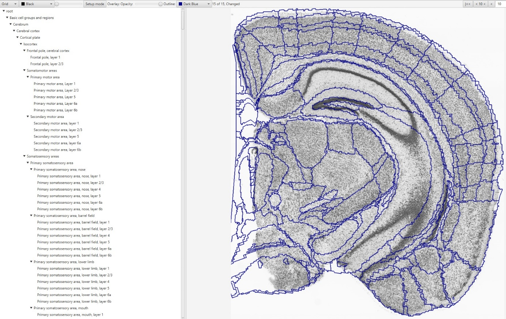
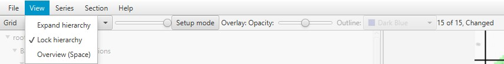

What is QCAlign?
================

QCAlign was developed for the validation of QUINT workflow performance
and to guide user post-processing of the QUINT results. It enables:

-  Quality control assessment of the atlas maps generated with QuickNII
   and VisuAlign

-  Quality control assessment of histological slice images

-  Exploration of the reference atlas hierarchy

The quality control steps are based on systematic sampling, with a grid
of points of fixed spacing positioned at random over the section images.
With the atlas superimposed, points can be marked over the histological
slice. Quality control assessment of the atlas maps is performed by
marking up whether a point is registered correctly, incorrectly, or of
uncertain position based on visible landmarks within the section. Using
the extent of their anatomical knowledge, the user assesses the
appearance of visible landmarks to validate the quality of the
registration to set a “ground truth.” For quality control assessment of
the histological slice images, there is a damage marker for marking up
areas that should be excluded from the analysis due to tissue damage,
artifacts, or errors in image acquisition. QCAlign generates reports
with marker counts per region. Percent (%) accurate, % inaccurate and %
uncertain per atlas registration per region can be calculated at the
slice and whole brain level. Percent (%) damage per region is calculated
based on the quality control of the slice images.

QCAlign also offers the capability to easily explore the reference atlas
hierarchy. This can be done as part of quality control assessment, or as
an independent procedure. QCAlign enables export of customized atlas
hierarchy files that are compatible with the Nutil Quantifier software
used in the QUINT workflow.

Currently QCAlign supports the Allen Mouse Brain Atlas CCFv3, 2015 and
2017 (reference) and the Waxholm Space Atlas of the Spraque Dawley Rat
v2 and v3 (reference).

Installation
============

QCAlign is downloaded as a zip archive file and can be extracted and run
anywhere on the computer by double click on “QCAlign.bat”.

Navigation
==========

All features of QCAlign can be found in the viewer window where the
histological slices are displayed. An adjustable hierarchy panel is
provided on the left-hand side, with functionality to adjust the
appearance, spacing, and transparency of the grid and/or reference atlas
overlay located above the list of regions. Functionality to navigate
between slices enabled in the top right-hand corner.

-  The **File** button provides “save as”, “import” and “export”
   functionality.

-  The **View** button provides “expand hierarchy”, “lock hierarchy”,
   and “Overview (Space)” functionality to visualize the hierarchy and
   provide an overview of the markers (also enabled by pressing the
   space bar).

-  The **Series** button provides grid options for the whole series:
   “prefill grid”, “clear grid”, “reset everything”.

-  The **Section** button provides grid options for the current section
   in the viewer: “prefill grid”, “clear grid” and “reset everything”.

.. image:: vertopal_cbedec83746b4aa08b3d6abec4c06604/media/image1.jpeg
   :width: 8.13333in
   :height: 4.95833in

Opening an image series
=======================

To load an image series in QCAlign, open the JSON file containing the
anchoring information exported from either QuickNII or VisuAlign. Go to:
**File** > **Open**

Hierarchy 
=========

Adjusting the hierarchy
-----------------------

An adjustable hierarchy panel is located on the left-hand side of the
QCAlign viewer window. To adjust the regions included on the slice atlas
viewer, click the ▼ arrow next to each region to reveal subdivisions or
► arrow to collapse the region into its parent structure.

The default setting reveals the finest granularity level of the atlas,
with all regions displayed (as shown in the example). From this
position, gradually collapse the hierarchy until a customized level is
achieved. The appearance of the atlas overlay in the viewer window
automatically adjusts to match the customized hierarchy selected.

Once you have created a customized hierarchy level that you would like
to work with, save the QCAlign JSON file by clicking **File > Save as**.
To reduce the need to adjust the hierarchy with each use, saved
customized JSON hierarchy sheets may be imported and implemented when
assessing multiple brain series.

**Example: All regions of the Allen Brain Atlas are expanded and visible
in the viewer window**

.. image:: vertopal_cbedec83746b4aa08b3d6abec4c06604/media/image2.png
   :width: 5.04087in
   :height: 3.20833in

Hierarchy import
----------------

1. To import a customized hierarchy level saved as a JSON file, go to
   **File** > **Import Hierarchy**.

2. Navigate to the JSON file and import. This only imports the
   customized hierarchy: not the markers, point spacing or other
   settings from the QCAlign JSON file.

Hierarchy export for use with Nutil Quantifier
----------------------------------------------

1. To export a customized hierarchy level to be used in Nutil, go to
   **File** > **export hierarchy sheet.**

2. When later navigating in Nutil, this .JSON file can be imported as a
   custom report file to receive quantification output for those
   specified regions.

.. _section-1:

Atlas overlay
=============

The appearance of the atlas overlay in the Viewer Window automatically
adjusts to match the hierarchy level selected in the left-hand panel.

The atlas overlay may be switched “on” or “off” with the opacity slider:

.. image:: vertopal_cbedec83746b4aa08b3d6abec4c06604/media/image3.png
   :width: 6.30055in
   :height: 0.44004in

-  In the far-left position, the overlay visibility is switched “off”.

-  In the middle position, the regions are displayed in the colors of
   the reference atlas, with the slider adjusting the color opacity.

-  In the far-right position, only the region outlines are visible.

By hovering over any part of the slice image, the region name to which
that point is registered to will be displayed.

**Example: The user’s cursor is located in a position registered as the
caudoputamen**

.. image:: vertopal_cbedec83746b4aa08b3d6abec4c06604/media/image4.png
   :width: 3.52699in
   :height: 2.23625in

Grid overlay
============

Grid aesthetics 
---------------

Adjust the appearance of the grid points by selecting between “grid”,
“dots” and “circles” in the top left-hand corner. There is also the
option to adjust the grid point color.

.. image:: vertopal_cbedec83746b4aa08b3d6abec4c06604/media/image5.png
   :width: 6.3in
   :height: 0.46806in

.. image:: vertopal_cbedec83746b4aa08b3d6abec4c06604/media/image6.png
   :width: 4.14151in
   :height: 1.66128in

Selecting and adjusting the grid spacing 
----------------------------------------

The grid spacing is defined in voxels based on the reference atlas. The
Allen Mouse Brain Atlas has a scale of 25µm\ :sup:`3` per voxel. This
means that a grid spacing of 10 voxels is equivalent to 10 x 25
µm\ :sup:`3` = 250µm\ :sup:`3` (250 µm in each of the x, y and z
directions).

While a finer grid spacing will give a more accurate results, finer grid
spacing also increases the workload required, and will not significantly
alter the result beyond a certain point. The optimal grid spacing is
established based on the user’s needs and requires the consideration of
workload and accuracy.

For meaningful results, aim for > 50 points per region-of-interest (e.g.
broad regions) across the whole series.

1. Select **Setup mode** to reveal the grid spacing panel.

.. image:: vertopal_cbedec83746b4aa08b3d6abec4c06604/media/image7.png
   :width: 6.06719in
   :height: 0.65339in

2. Enter an appropriate grid spacing. (e.g. 15 voxels)

3. The appearance of the grid point overlay in the viewer window
   automatically adjusts to match the selected grid spacing.

4. Unselect Setup Mode when a value has been input to lock in that grid
   spacing level.

Marking grid points within a slice
==================================

Marking grid points for quality control assessment of registration alignment
----------------------------------------------------------------------------

1. Start on the first slice of the series by clicking \|<< arrow in the
   upper-right corner. Proceed to each subsequent slice by clicking >

2. In the slice viewer, only mark atlas points that overlap the
   experimental slice. Select between four options by clicking the grid
   points with the mouse or keyboard. For quality control assessment of
   the atlas maps, use the **(+), (-)** and **(?)** markers only.

   -  **Accurate: (+) Single click, Keyboard shortcut: 2** Use this
      marker for grid points that are *correctly* located in the
      assigned region: this is verified by the anatomist based on
      landmarks. The region boundaries are distinct enough to make this
      call.

   -  **Inaccurate: (-) Double click, Keyboard shortcut: 3** Use this
      marker for grid points that are *incorrectly* located in the
      assigned region: this is verified by the anatomist based on
      landmarks. The region boundaries are distinct enough to make this
      call.

   -  **Uncertain: (?) Triple click, Keyboard shortcut: 4** Use this
      marker if you are uncertain whether the grid point is located in
      the assigned region or not: the region boundaries are not distinct
      enough to make this call. This does not mean that the registration
      is incorrect, only that verification is not possible based on the
      available imaging data alone.

3. To get an overview of the grid points and easily identify grid points
   that remain unmarked within a slice, go to **View** > **Overview,**
   or press the spacebar.

Autofill grid markers
---------------------

To reduce the workload for the atlas map assessment, it is possible to
autofill all the markers as **(+)**, with the exception of the markers
that are closest to the region boundaries. To enable this feature, go to
**Series Prefill grid, except damage markers.** The markers closest to
the region boundaries remain unmarked. The user must manually mark up
the points that fall along the region boundaries to ensure precise
marker classification. Grid points along regional borders are more prone
to registration errors.

-  This feature was introduced to increase efficiency, whilst minimizing
   bias introduced by autofill.

Marking grid points for quality control assessment of histological slices and brain tissue
------------------------------------------------------------------------------------------

The tissue quality or histology integrity of the slices in a series can
be assessed with the **(x)** marker. This assessment is completed
independently of the accurate, inaccurate, and uncertain series
assessment.

-  **Damage: (x**) **Quadruple click, Keyboard shortcut: 5** Use this
   marker for grid points positioned over areas that should not be
   included in the analysis. For example, overlaying areas with tissue
   damage, artifacts such as air bubbles, or parts of the image that are
   out-of-focus.

-  **An example image for this marker is given at the end of this
   section.**

Completion of marking grid points
---------------------------------

1. Use the > in the far-right corner of the window to proceed through
   all slices and add markers to all grid points in the series.

2. Save results in a JSON file. **File** > **Save as**.

3. Export statistics in txt file. **File** > **Export stats**.

This generates a text file with all the regions listed vertically, with
four rows per region titled “accurate”, “inaccurate”, “uncertain” and
“damaged” that list the number of markers for each.

Examples of Accurate, Inaccurate, and Uncertain Markings
--------------------------------------------------------

|image1|\ **Example 1: Section with clearly visible landmarks
demonstrating use of (+) and (-) markers.**

There are clear boundaries between all the structures in this slice due
to differences in tissue appearance, and clearly visible cell layers in
the case of the hippocampus. All regions can be marked up with
certainty: (+) or (-). One of the points is registered to the ventricle
despite being located in the fiber tract and has been marked up with
**(-)**. All the other markers are marked up with **(+).**

**Example 2: Section with clearly visible landmarks and inaccurate
registration.**

.. image:: vertopal_cbedec83746b4aa08b3d6abec4c06604/media/image9.jpeg
   :alt: Z:\NESYS_Lab\PhD_project_Yates_Sharon\Jackson_article\QControl\User_manual\Inaccurate.jpg
   :width: 4.94697in
   :height: 2.42422in

**Example 3: Section with ambiguous boundaries demonstrating use of the
(?) marker.**

.. image:: vertopal_cbedec83746b4aa08b3d6abec4c06604/media/image10.jpeg
   :width: 6.3in
   :height: 4.82222in

There are clear boundaries between the lateral ventricle, the
caudoputamen, the corpus callosum, and the isocortex in this slice.
These regions can be marked up with certainty (+) and (-).

There is less certainty for the outer boundary of the cortical subplate,
and the boundary between the isocortex, entorhinal area and olfactory
area. These areas have been marked up with transparent red circles and
have been assigned the **(?)** marker.

The placement of the **(?)** will vary for regions from slice to slice
depending on the distinction of visual landmarks.

Examples of Damage Markings
---------------------------

|image2|\ **Example: Small tears within the histological slice are
marked with the (x) to indicate damage of that region.**

.. _section-2:

.. _section-3:

.. _section-4:

.. _section-5:

.. _section-6:

.. _section-7:

.. _section-8:

.. _section-9:

.. _section-10:

Exploration of the reference atlas hierarchy
============================================

All regions of the Allen Brain Atlas can be viewed in the slice viewer
by clicking **View >** **Expand Hierarchy**

.. image:: vertopal_cbedec83746b4aa08b3d6abec4c06604/media/image12.jpeg
   :width: 6.3in
   :height: 0.77896in

**Example: Hierarchy with all regions of the Allen Brain Atlas
expanded**

The user can selectively display certain regions of the atlas by
expanding (▼) or collapsing (►) regions presented in the list of regions
on the left of the window. Selection of regions to visualize can be
based on the user’s specific regions of interest or based on regions
that have high accuracy scores.

Any combination of regions can be expanded or collapse to create a
customized hierarchy.

**Example: Customized hierarchy with select regions, including the
isocortex, olfactory areas, and Ammon’s horn, collapsed**

.. image:: vertopal_cbedec83746b4aa08b3d6abec4c06604/media/image14.jpeg
   :width: 5.90683in
   :height: 3.7093in

When the desired atlas hierarchy level is achieved for the user’s best
intentions, click **View > Lock Hierarchy.**

.. image:: vertopal_cbedec83746b4aa08b3d6abec4c06604/media/image12.jpeg
   :width: 6.96353in
   :height: 0.86046in

The regions in the hierarchy window are then set and can only be
manipulated or changed when the hierarchy is unlocked by clicking “Lock
Hierarchy” again.

.. |image1| image:: vertopal_cbedec83746b4aa08b3d6abec4c06604/media/image8.jpeg
   :width: 5.85417in
   :height: 4.77083in
.. |image2| image:: vertopal_cbedec83746b4aa08b3d6abec4c06604/media/image11.jpeg
   :width: 3.84306in
   :height: 4.51181in
