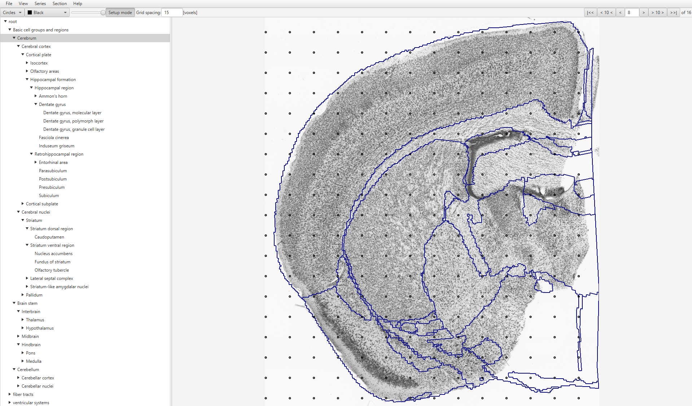
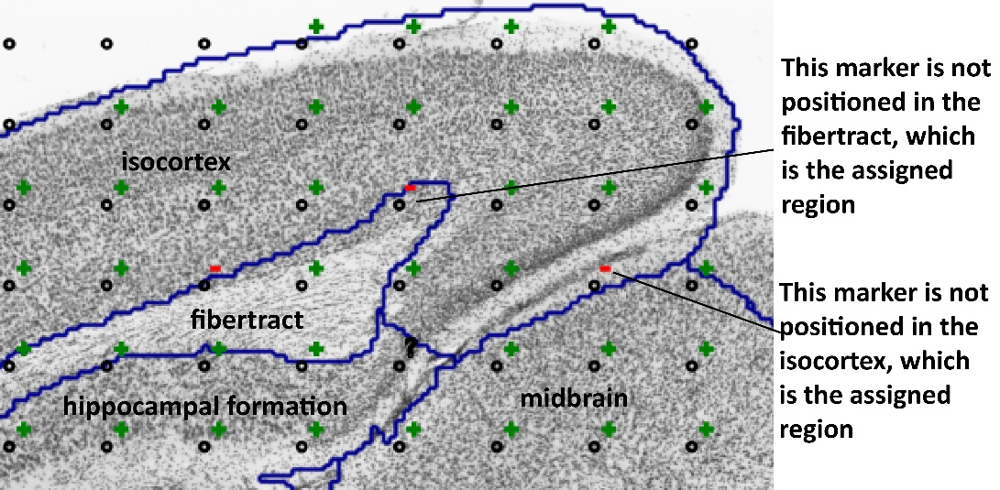
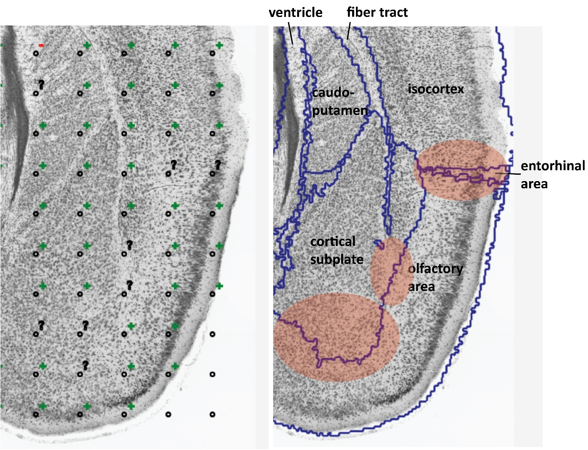
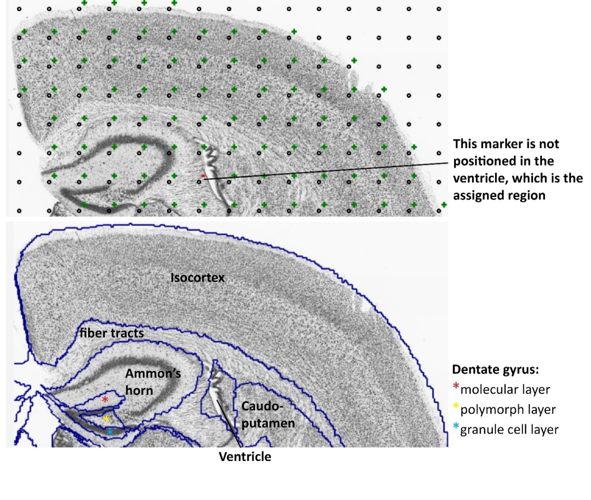
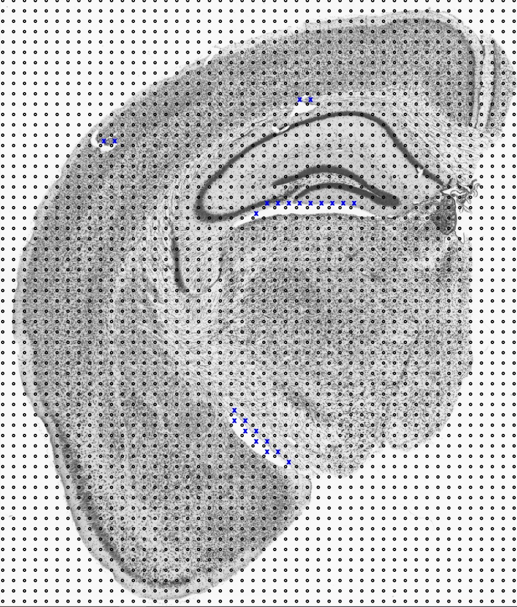

**2. QC Assessment of the Atlas-Registration**
=========================================================

The registration of the section images to a reference atlas is performed with `QuickNII and VisuAlign. <https://ebrains.eu/service/quicknii-and-visualign/>`_ Even with both the linear (QuickNII) and nonlinear (VisuAlign) steps applied, it can be difficult to achieve a good match due to mechanical distortions occurring during slice preparation, but also due to anatomical differences between the experimental models and the standard animals used to prepare the atlas. The QC assessment enables detection of regions that are poorly registered, or where the registration cannot be verified as there are no boundaries in the sections that match the delineations at the hierarchy level selected for QCAlign.

**Read the Best Practise section before starting the assessment.**

Best Practise 
---------------
 
As QCAlign is used for validation, the researcher's input represents the anatomical “ground truth”.

- A useful anatomy resource while working with the tool is the `Allen Brain Atlas Interactive Brain Viewer <http://mouse.brain-map.org/static/atlas>`_ (coronal atlas, Nissl stain). This can be used as a guide and to refresh your anatomical knowledge.
- Make the decision for each point with the region outlines switched "off". By hovering over any point on the brain tissue, a text overlay is displayed that reveals the region to which the point is registered. Use this information, any visible landmarks, and your anatomical knowledge to assess whether the point is registered correctly, incorrectly, or of uncertain position.
- Use the (?) in all instances when you are unsure of the correct assignment due to undiscernible boundaries or limited anatomical knowledge. **If in doubt, always mark up (?)**.
- For an overview of the atlas delineations toggle the region outlines "on" and "off" with the opacity slider. While it can be helpful with an overview, try not to let the delineations affect your decision-making as this will bias the outcome. 

How to perform the assessment
------------------------------

1. Open the JSON file from QuickNII or VisuAlign that corresponds to the image series and the delineations that you would like to assess. 

2. Adjust the `atlas hierarchy <https://qcalign.readthedocs.io/en/latest/hierarchy.html>`_, the `grid spacing <https://qcalign.readthedocs.io/en/latest/gridoverlay.html#selecting-and-adjusting-the-grid-spacing>`_ and the `grid aesthetics. <https://qcalign.readthedocs.io/en/latest/gridoverlay.html#grid-aesthetics>`_

3. Use the opacity slider to adjust the appearance of the `atlas overlay <https://qcalign.readthedocs.io/en/latest/atlasoverlay.html>`_ in the viewer window. Switch the delineations "off" for the assessment. 

4. Start on the first section of the series by clicking the \|<< arrow in the upper-right corner. Proceed to each subsequent section by clicking >

5. In the section viewer, mark up points that overlap the section. Points that fall outside of the experimental section should be left blank. 

For assessment of the registration, use the **+**, **-** and **?** markers only. Whether a grid point is located in the assigned region (+), is not located in the assigned region (-), or whether this is uncertain (?) is verified by the researcher based on visible landmarks within the section. 

+------------+--------------+-------------------+-------------------+
| **Marker** | **Mouse**    | **Keyboard**      | **Usage**         |
|            |              |                   |                   |
+============+==============+===================+===================+
| (+)        | Single click | 2                 | The grid point    |
|            |              |                   | is located in the |
|            |              |                   | assigned region   |
+------------+--------------+-------------------+-------------------+
| (-)        | Double click | 3                 | The grid point    |
|            |              |                   | is not located    |
|            |              |                   | in the assigned   |
|            |              |                   | region            |
+------------+--------------+-------------------+-------------------+
| (?)        | Triple click | 4                 | It is uncertain   |
|            |              |                   | whether the grid  |
|            |              |                   | point is located  |
|            |              |                   | in the assigned   |
|            |              |                   | region            |
+------------+--------------+-------------------+-------------------+

It is fastest to work with the keyboard shortcuts: by holding down the shortcut and scrolling over points in turn you activate “paint” functionality.  

6. To get an overview of the grid points, and to easily identify grid points that remain unmarked within a section, go to **View** > **Overview,** or press the spacebar.

7. Use the > in the far-right corner of the window to proceed through all sections.

8. Proceed until all the sections have been marked up. 

9. Save the results in a JSON file. **File** > **Save as**.

10. Export statistics in txt format. **File** > **Export stats**.
      

Example 1: Section with visible landmarks  
--------------------------------------------------

|image1|\ 

There are clear boundaries between all the structures in this section due
to differences in tissue appearance, and clearly visible cell layers in
the case of the hippocampus. All regions can be marked with
certainty: (+) or (-). One of the points is registered to the ventricle
despite being located in the fiber tract and has been marked with
**(-)**. All the other markers are marked up with **(+).**

Example 2: Section with visible landmarks 
-------------------------------------------------

Example 3: Section with ambiguous boundaries
-------------------------------------------

There are clear boundaries between the lateral ventricle, the
caudoputamen, the corpus callosum, and the isocortex in this section.
These regions can be marked up with certainty (+) and (-).

There is less certainty for the outer boundary of the cortical subplate,
and the boundary between the isocortex, entorhinal area and olfactory
area. These areas have been marked up with transparent red circles and
have been assigned the **(?)** marker.

The placement of the **(?)** will vary for regions from section to section
depending on the distinction of visual landmarks.

