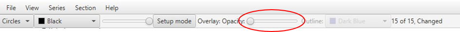

**Atlas overlay**
=================

The appearance of the atlas overlay in the Viewer Window automatically
adjusts to match the hierarchy level selected in the left-hand panel.

The atlas overlay may be switched “on” or “off” with the opacity slider:

-  In the far-left position, the overlay visibility is switched “off”.

-  In the middle position, the regions are displayed in the colors of
   the reference atlas, with the slider adjusting the color opacity.

-  In the far-right position, only the region outlines are visible.

By hovering over any part of the slice image, the region name to which
that point is registered to will be displayed.

**The user’s cursor is located in a position registered as the
caudoputamen**

.. image:: vertopal_cbedec83746b4aa08b3d6abec4c06604/media/image4.png
   :width: 3.52699in
   :height: 2.23625in
