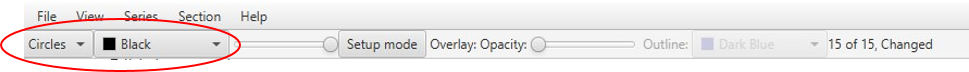
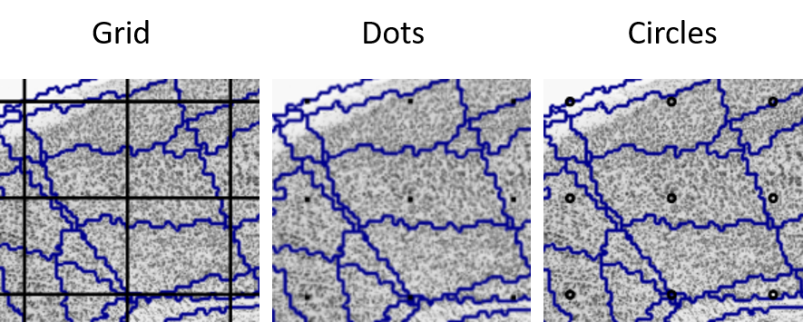
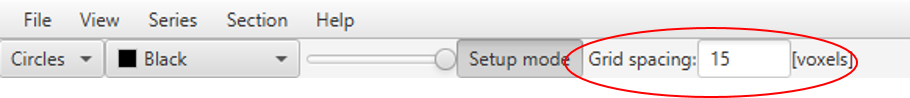

**Grid overlay**
================

**Grid aesthetics** 
---------------

Adjust the appearance of the grid points by selecting between “grid”,
“dots” and “circles” in the top left-hand corner. There is also the
option to adjust the grid point color.

**Selecting and adjusting the grid spacing** 
----------------------------------------

The grid spacing is defined in voxels based on the reference atlas. The
Allen Mouse Brain Atlas has a scale of 25µm\ :sup:`3` per voxel. This
means that a grid spacing of 10 voxels is equivalent to 10 x 25
µm\ :sup:`3` = 250µm\ :sup:`3` (250 µm in each of the x, y and z
directions).

While a finer grid spacing will give more accurate results, finer grid
spacing also increases the workload, and will not significantly
alter the result beyond a certain point. The optimal grid spacing is
established based on the researcher’s needs (for example: the size of the regions-of-interest) and requires consideration of
the workload and desired accuracy level.

For meaningful results, aim for > 50 points per region-of-interest (e.g.
broad regions) across the whole series.

1. Select **Setup mode** to reveal the grid spacing panel.

2. Enter an appropriate grid spacing. (e.g. 15 voxels)

3. The appearance of the grid point overlay in the viewer window
   automatically adjusts to match the selected grid spacing.

4. Unselect Setup Mode when a value has been input to lock in that grid
   spacing level.
