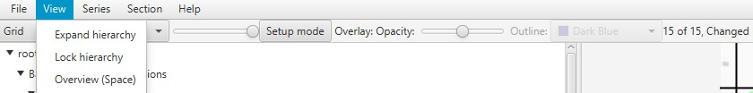
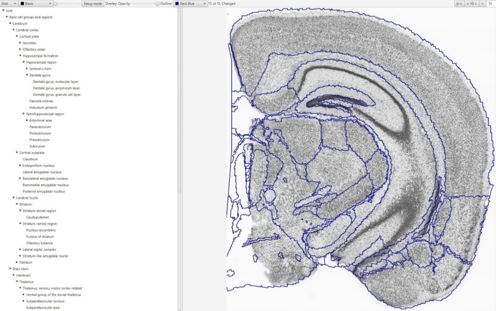

**Exploring the hierarchy**
============================

An adjustable hierarchy panel is located on the left-hand side of the
QCAlign viewer window. To adjust the regions click the ▼ arrow next to each region to reveal subdivisions or
► arrow to collapse the region into its parent structure. The appearance of the atlas overlay in the viewer window
automatically adjusts to match the customized hierarchy selected.

The default setting reveals the finest granularity level of the atlas,
with all regions displayed. From this position, gradually collapse the hierarchy until a customized level is
achieved. 

The hierarchy will automatically lock when grid points are marked up. To lock and unlock the hierarchy, click **View > Lock hierarchy**. Care should be taken with this feature as adjusting the hierarchy invalidates existing markers. Always reset all markers after adjusting the hierarchy. **Series > Reset everything**.

**In the example all regions of the Allen Mouse Brain Atlas are expanded and visible
in the viewer window**

.. image:: vertopal_cbedec83746b4aa08b3d6abec4c06604/media/image2.png
   :width: 5.04087in
   :height: 3.20833in

To go back to the finest granuality level, click **View >** **Expand Hierarchy**

   
**Creating a Customized Hierarchy**
-----------------------------------
Reference atlases are developed and refined over time based on input from multiple disparate datasets; and are structured in adjustable hierarchies with smaller sub-regions belonging to larger "parent" structures (for example, the thalamic nuclei belong to the thalamus). Reference atlases contain boundaries that are not possible to discern in individual series, which are typically labelled to reveal one or two features only (for example, a particular cell type). For this reason, it is necessary to adjust the hierarchy to a level that supports verification for assessment of the atlas-registration. 

For QC assessment of the registration the goal is to create a hierarchy level that matches the region boundaries that are visible in the series, but is also as detailed as possible. Creating a customized level is done in a step-by-step process, starting at the finest granularity level, with each region collapsed in turn to a level that matches the boundaries visible in that region. While it will not be possible to achieve a perfect match, it is possible to achieve a good match that supports verification. The "uncertainty" marker is available for areas of uncertainty. 

To use the customized hierarchy level for QUINT analysis, see the **Exporting the Hierarchy** section below.  

**Saving the Hierarchy**
------------------------------

Once you have created a customized hierarchy level that you would like
to work with, save the QCAlign JSON file by clicking **File > Save as**.

**Customized hierarchy with select regions, including the
isocortex, olfactory areas, and Ammon’s horn, collapsed**

**Importing a Hierarchy**
---------------------------

A customized hierarchy may be imported from a QCAlign JSON file into another QCAlign JSON to reduce the need to adjust the hierarchy with each run. 
This feature is useful when assessing multiple brain series. 

1. To import a customized hierarchy level saved in a QCAlign JSON file, go to
   **File** > **Import Hierarchy**.

2. Navigate to the JSON file and import. This only imports the
   customized hierarchy: not the markers, point spacing or other
   settings from the QCAlign JSON file.

**Exporting the Hierarchy**
-----------------------------

The purpose of hierarchy export feature is to generate a .TXT file that is compatible with Nutil Quantifier. 

1. To export a customized hierarchy to be used in Nutil, go to:
   **File** > **export hierarchy sheet.**
   
2. The TXT file can be used directly in Nutil, or may be used to create a CustomRegions.xlsx for use with Nutil Quantifier. 

.. Warning::
   The the CustomRegion.xlsx file has a slightly different structure to the TXT file. If the TXT file is imported in Excel, edit to match the required .xlxs structure before using in Nutil. 

For more information on Nutil customized reports see: https://nutil.readthedocs.io/en/latest/QuantifierReports.html 

.. _section-1:
