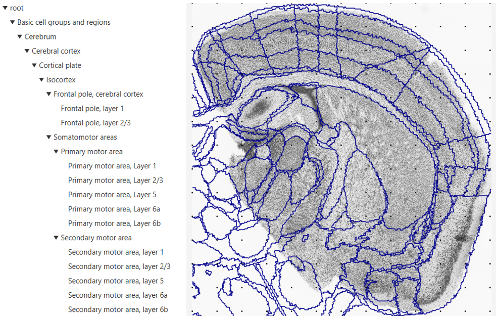

**Exploring the hierarchy**
============================

An adjustable hierarchy panel is located on the left-hand side of the
QCAlign viewer window. To adjust the regions click the ▼ arrow next to each region to reveal subdivisions or
► arrow to collapse the region into its parent structure. The appearance of the atlas overlay in the viewer window
automatically adjusts to match the customized hierarchy selected.

The default setting reveals the finest granularity level of the atlas,
with all regions displayed (as shown in the example). From this
position, gradually collapse the hierarchy until a customized level is
achieved. 

Once you have created a customized hierarchy level that you would like
to work with, save the QCAlign JSON file by clicking **File > Save as**.

To reduce the need to adjust the hierarchy with each use, a customized hierarchy may be imported from a QCAlign JSON file. 
This feature is useful when assessing multiple brain series. 

**Example: All regions of the Allen Mouse Brain Atlas are expanded and visible
in the viewer window**

**Hierarchy import**
-----------------

1. To import a customized hierarchy level saved in a QCAlign JSON file, go to
   **File** > **Import Hierarchy**.

2. Navigate to the JSON file and import. This only imports the
   customized hierarchy: not the markers, point spacing or other
   settings from the QCAlign JSON file.

**Hierarchy export**
---------------------

The purpose of hierarchy export is to generate a TXT file that is compatible with Nutil Quantifier. 

1. To export a customized hierarchy level to be used in Nutil, go to
   **File** > **export hierarchy sheet.**
   
2. The information in the TXT file may be used to create a CustomRegions.xlsx for use with Nutil Quantifier. This is used to generate customised reports. 

For more information on Nutil customised reports see: https://nutil.readthedocs.io/en/latest/QuantifierReports.html 

.. _section-1:
