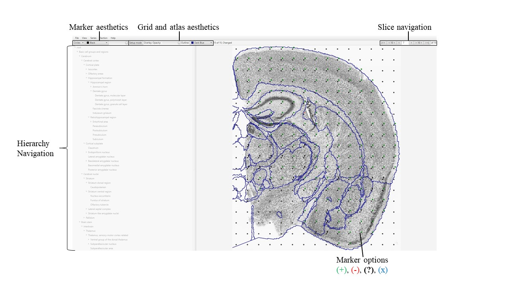

**Navigation**
---------------

QCAlign has a similar setup to VisuAlign, with the histological slice images displayed in a Viewer Window. An adjustable hierarchy panel is provided on the left-hand side, with functionality for adjusting the appearance, spacing, and transparency of the grid and/or reference atlas overlay located above the list of regions. Functionality for navigating between the slices is enabled in the top right-hand corner.

-  The **File** button provides “save as”, “import” and “export”
   functionality.

-  The **View** button provides “expand hierarchy”, “lock hierarchy”,
   and “Overview (Space)” functionality to visualize the hierarchy and
   provide an overview of the markers (also enabled by pressing the
   space bar).

-  The **Series** button provides grid options for the whole series:
   “prefill grid”, “clear grid”, “reset everything”.

-  The **Section** button provides grid options for the current section
   in the viewer: “prefill grid”, “clear grid” and “reset everything”.

Opening an image series
=======================

To load an image series in QCAlign, open the JSON file containing the
anchoring information exported from either QuickNII or VisuAlign. Go to:
**File** > **Open**
