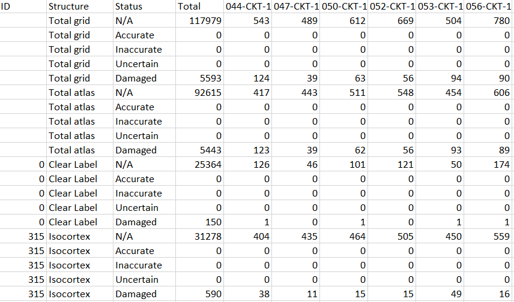

**QCAlign Results**
===============

To export the results of either of the QC assessments go to: **File > Export stats**.

This generates a .TXT file that lists all the regions vertically with corresponding marker counts. 

.. list-table:: 
   :widths: 50 50
   :header-rows: 1

   * - Structure
     - Definition
   * - Total grid
     - Markers in the whole grid
   * - Total atlas
     - Markers within the atlas map
   * - Clear Label
     - Markers that fall outside of the atlas maps

For each region there are five rows titled **N/A**, **Accurate**, **Inaccurate**, **Uncertain**, and **Damaged**. There is a row for the whole series and a row per section. 

.. list-table:: 
   :widths: 50 50
   :header-rows: 1

   * - Status
     - Definition
   * - N/A
     - No. of markers that have not been assigned a category.
   * - Accurate
     - No. of markers assigned as accurate.
   * - Inaccurate
     - No. of markers assigned as inaccurate.
   * - Uncertain
     - No. of markers assigned as uncertain.
   * - Damaged
     - No. of markers representing damage.
     

**How to calculate % accuracy /inaccuracy / uncertainty?**
------------------------------------------------------------

For the QC assessment of the atlas-registration the counts may be used to calculate % “verified as accurate”, % “verified as inaccurate” and "% that is uncertain" for each region for the complete series and for each section. The calculations may be performed for refeence atlas regions or for compilations of reference atlas regions. The calculations are performed as follows:

Accuracy Score = (no. of accurate markers)/ (no. of accurate markers + no. of inaccurate markers)
Inaccuracy Score = (no. of inaccurate markers)/ (no. of accurate markers + no. of inaccurate markers)
Uncertainty Score = (no. of uncertain markers)/ (no. of accurate markers + no. of inaccurate markers + no. of uncertain markers)

**How to calculate % damage?**
------------------------------
     
For the QC assessment of the sections the counts may be used to calculate % damage for the whole series, for each section, per region, or per region for each section. 

.. note::
   % damage = no. of damage markers / total markers  * 100
   
The damage here represents tissue damage, poor quality labelling and imaging defects. 

**How to use the results?**
----------------------------

The results from QCAlign may be used to guide decision-making regarding post-processing of the QUINT results. For example:

- exclude all sections or regions that have more than 30% damage from the QUINT results.

- improve the registration of regions with < 90% accuracy. 

- If a lot of uncertainty is detected for a particular region (for example, the thalamus subdivided into thalamic nuclei), the results may prompt reporting at a coarser granularity level if higher confidence in the atlas-registration is required.  

